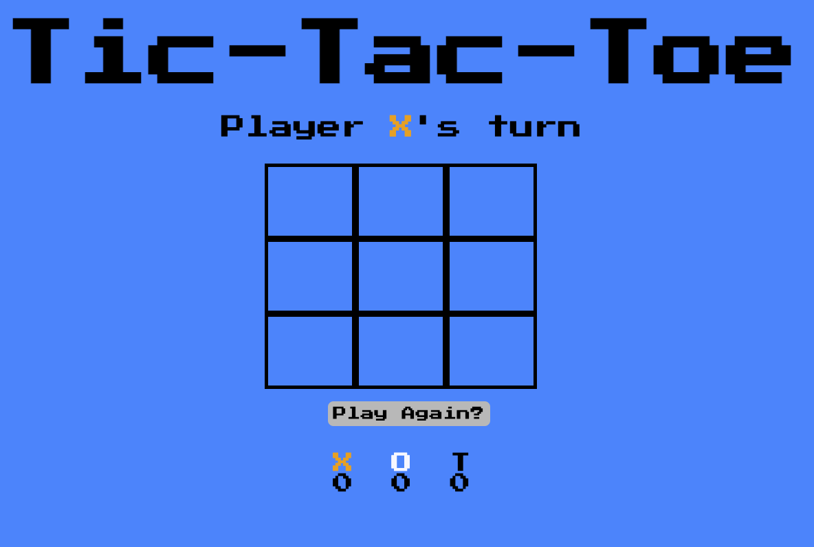
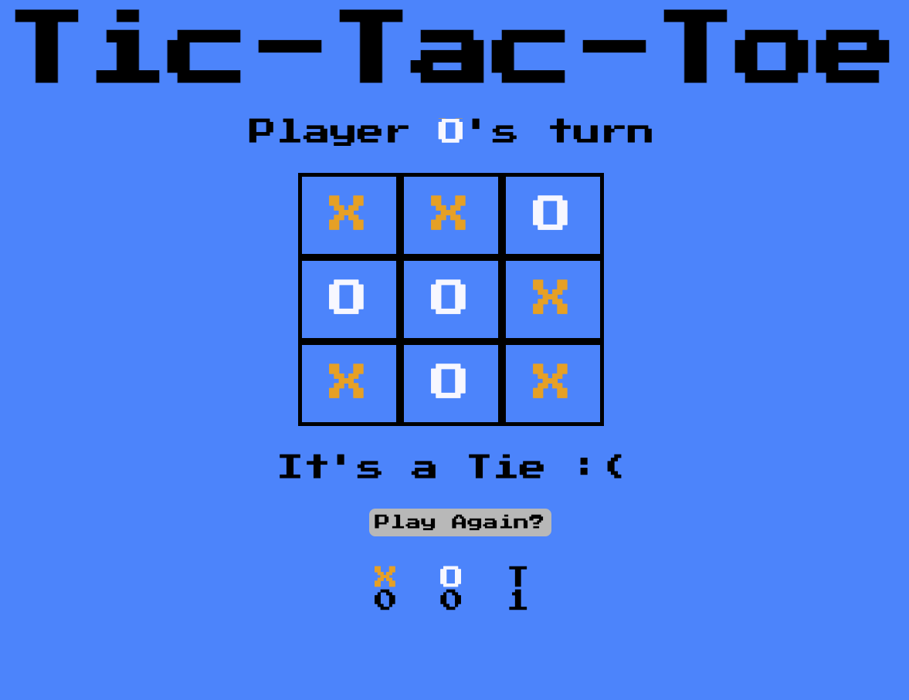
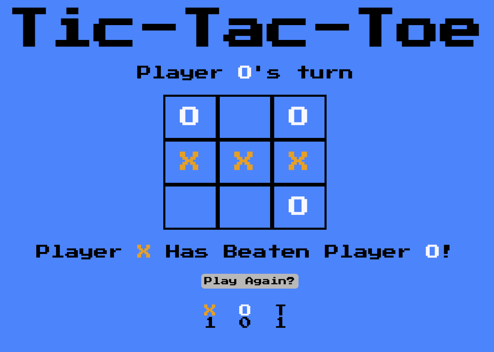
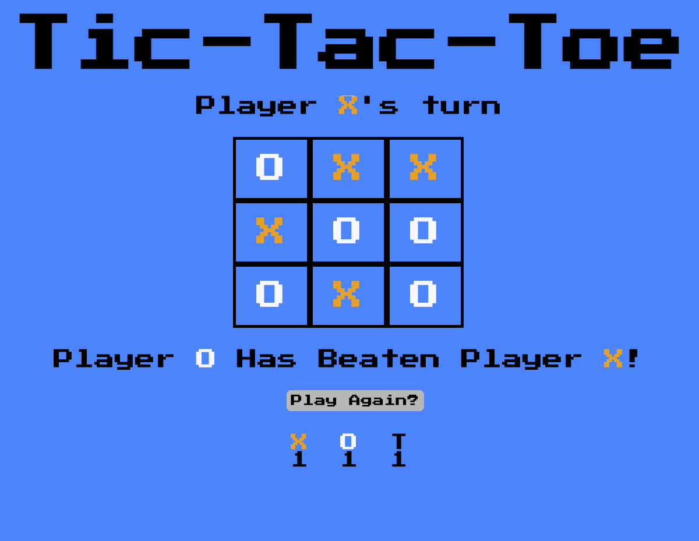

# Tic-Tac-Toe

## Date: 6/24/2022

### Created By: Matthew Russelli

#### [Linkedin](https://www.linkedin.com/in/matthewrusselli/) | [GitHub](https://github.com/MattRusselli)

---

### **_Deployed Game_**

#### [Tic-Tac-Toe](https://delirious-cherries.surge.sh/)

### **_Description_**

#### A simple browser Tic-Tac-Toe game built with vanilla Javascript

---

### **_Technologies Used_**

- HTML
- CSS
- Javascript

---

### **_Screen Shots_**

### **_Future Goals_**

- Implement a simple AI so users can have the option to play solo.
  - A more complex AI with logic to try to beat the user.